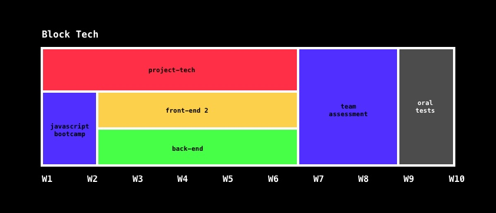

# ![Backend - Course 2018-2019][banner]

## Table of Contents

*   [Synopsis](#synopsis)
*   [Description](#description)
*   [Communication](#communication)
*   [Goals](#goals)
*   [Grade](#grade)
*   [Resources](/resources.md)
*   [Conduct](#conduct)
*   [License](#license)

## Synopsis

The course **Backend** is given at [**@CMDA**][cmda] in 2019 between
4 February and 20 June.

*   **Course**: Backend
*   **Coordinator**: [Danny de Vries][dangit]
*   **Lecturers**:
    [Danny de Vries][dangit] ([**@dandevri**][danweb]) (BT 3 / *tech2* and BT 4 / *tech4*) and
    [Laurens Aarnoudse][razgit] ([**@razpudding**][razweb])
    (BT 4 / *tech3*)
*   **SIS**: Backend Development
*   **Credit**: 3 ECTS
*   **Academic year**: 2018-2019
*   **Period**: Quarter 3 (spring)
*   **Programme**: Communication and Multimedia Design (full time bachelor)
*   **Language**: Dutch instructions and English resources
*   **Entry requirements**: N/A

## Description
In Backend we peek behind the curtains and inspect what’s behind the web. You build web apps with [Node.js][node], communicate with [HTTP][http], and store data in a database with [MongoDB][mongodb]. In this course you’ll advance your web dev skills. You’ll learn to use computers to actually make what you design work: people can actually fill in forms, like things, and upload files.

Backend is an elective course given in Quarter 3 (spring) after the core curriculum of our programme, building further on knowledge acquired in *Internetstandaarden*, *Inleiding Programmeren*, and *Blok Web*. 

This course is chosen alongside **Frontend 2** and **Project Tech**, together making up Block Tech. In project Tech you’ll learn how to navigate the command line, version control with Git, and deploy your app. In Project Tech you’ll apply your newfound backend skills.

If you’d like to continue with web development after this course, do a tech internship next quarter (Q4), choose the [Tech Track][track] for the fall semester next year, and pick [Minor Everything Web][minor] in the spring semester after that.

## Communication

*   [GitHub][gh] — Main source of information, assignments, important dates,
    and more
*   [Examples][examples] — Example code from slides
*   [Slack][slack] — General chatter and Q&A
*   [Moodle][moodle] — Schedulers


If you have questions:

*   Read the manual for the technology in question
    ([Git](https://git-scm.com/docs),
    [GitHub](https://guides.github.com),
    [Node](https://nodejs.org/api/),
    [npm](https://docs.npmjs.com),
    [express](http://expressjs.com/en/4x/api.html),
    [MongoDB](https://docs.mongodb.com))
*   [Browse examples][examples]
*   [Search StackOverflow][stackoverflow]
*   [Use a search engine like DuckDuckGo][duckduckgo]
*   [Ask questions on Slack][slack]
*   [Contact a lecturer][synopsis]

## Goals

#### Main goals

The 2 main goals in this course are that you’re able to:

*   Build web apps with Node
*   Store data in a database

#### Sub goals

In practice you’ll learn to:

* <a name="subgoal-1"></a>
    Understand Node principles ([**week 1**][w1])
*  <a name="subgoal-2"></a>
    Use packages from npm ([**week 1**][w1])
* <a name="subgoal-3"></a>
    Communicate over HTTP ([**week 2**][w2])
* <a name="subgoal-4"></a>
    Use web frameworks like express ([**week 2**][w2])
* <a name="subgoal-5"></a>
    Render data server-side ([**week 2**][w2])
* <a name="subgoal-6"></a>
    Upload data and files to servers ([**week 3**][w3])
* <a name="subgoal-7"></a>
    Respond with data from a server ([**week 3**][w4])
* <a name="subgoal-8"></a>
    Request data from clients ([**week 3**][w4])
* <a name="subgoal-9"></a>
    Connect to database with Mongoose ([**week 4**][w4])
* <a name="subgoal-10"></a>
    Get data from MongoDB ([**week 4**][w4])
* <a name="subgoal-11"></a>
    Debugging, error handling and deploying ([**week 5**][w5])

The below table breaks down the general time needed per week.

| Week | Effort | Topic            | Activities                                             |
| ---- | -----: | ---------------- | ------------------------------------------------------ |
| 0    |  NaN   | getting started  | [getting started][gs]                 |
| 1    |  9:20h | node & npm       | [lab][w1lab], [lecture][w1lec], [assignments][w1a]     |
| 2    |  9:20h | http & express   | [lab][w2lab], [lecture][w2lec], [assignments][w2a]     |
| 3    |  9:20h | data & requests  | [lab][w3lab], [lecture][w3lec], [assignments][w3a]     |
| 4    |  9:20h | databases        | [lab][w4lab], [lecture][w4lec], [assignments][w4a]     |
| 5    |  9:20h | debug & deploy   | [lab][w5lab], [assignments][w5a], work on prototype    |
| 6    | 13:20h | prototype        | [lab][w6lab],  work on protype                         |
| 7    |  NaN   | oral test        | [oral test][grading]                                   |

<details>
    <summary>Schedule</summary>
    
</details>

## Grade

| Task                                |   Weight |
| ----------------------------------  | -------: |
| [Participation][grading]            |      10% |
| [Assesment 1][grading] (oral test)  |      60% |
| [Assesment 2][grading] (oral test)  |      30% |
| **Total**                           | **100%** |


```js
if (!participation && !a1 && !a2) {
  grade = 'GR'
} else if (a1 < 5.5 || a2 < 5.5) {
  grade = 1
} else {
  grade = (participation * 0.1) + (a1 * 0.6) + (a2 * 0.3)
}
```

## Programme

This course is given at [Communication and Multimedia Design][bachelor], a
design bachelor focused on interactive digital products and services.  CMD is
part of the [Faculty of Digital Media and Creative Industries][faculty] at the
[Amsterdam University of Applied Sciences][university].

## Conduct

This course has a [Code of Conduct][coc].  Anyone interacting with this
repository, organisation, or community is bound by it.

Staff and students of the Amsterdam University of Applied Sciences (Hogeschool
van Amsterdam) are additionally bound by the [Regulation Undesirable
Conduct][ruc] ([Regeling Ongewenst Gedrag][rog]).

## License

Unless stated otherwise, code is [MIT][] © [Titus Wormer][author1] and Modified by [Danny de Vries][author2],
docs and images are [CC-BY-4.0][].

[banner]: https://cmda-bt.github.io/be-course-18-19/assets/banner.svg
[cmda]: https://github.com/cmda
[dangit]: https://github.com/dandevri
[danweb]: https://github.com/dandevri
[razgit]: https://github.com/razpudding
[razweb]: https://github.com/razpudding
[node]: https://nodejs.org/en/
[mongodb]: https://www.mongodb.com/
[http]: https://tools.ietf.org/html/rfc2068
[minor]: https://cmda.github.io/minor-everything-web/
[track]: https://github.com/cmda-tt
[gh]: https://github.com/cmda-be/course-18-19
[examples]: /examples
[slack]: https://cmda-tech.slack.com/
[moodle]: https://moodle.cmd.hva.nl/course/view.php?id=431
[examples]: examples
[stackoverflow]: https://stackoverflow.com
[duckduckgo]: https://duckduckgo.com
[synopsis]: #synopsis
[grading]: grading.md
[bachelor]: https://www.cmd-amsterdam.nl/english/
[faculty]: https://www.amsterdamuas.com/faculty/fdmci/faculty-of-digital-media-and-creative-industries.html
[university]: https://www.amsterdamuas.com
[coc]: code-of-conduct.md
[ruc]: https://www.amsterdamuas.com/practical-matters/algemeen/hva-breed/juridische-zaken/legal-affairs/regulation-undesirable-conduct/regulation-undesirable-conduct.html#anker-3-complaints-authority
[rog]: https://www.hva.nl/praktisch/algemeen/hva-breed/juridische-zaken/loket-beroep-bezwaar-en-klacht/regeling-ongewenst-gedrag/regeling-ongewenst-gedrag.html?origin=gbS4rg%2FDTZuxQ6lGVF%2BN1A
[author1]: https://wooorm.com
[author2]: https://dandevri.es
[mit]: license.md#code
[cc-by-4.0]: license.md#documentation-and-images

[gs]: getting-started.md

[w1]: week-1.md

[w2]: week-2.md

[w3]: week-3.md

[w4]: week-4.md

[w5]: week-5.md

[w6]: week-6.md

[w1lec]: week-1.md#lecture

[w2lec]: week-2.md#lecture

[w3lec]: week-3.md#lecture

[w4lec]: week-4.md#lecture

[w5lec]: week-5.md#lecture

[w6lec]: week-6.md#lecture

[w1lab]: week-1.md#lab

[w2lab]: week-2.md#lab

[w3lab]: week-3.md#lab

[w4lab]: week-4.md#lab

[w5lab]: week-5.md#lab

[w6lab]: week-6.md#lab

[w7lab]: week-7.md#lab

[w8lab]: week-8.md#lab

[w1a]: week-1.md#assignments

[w2a]: week-2.md#assignments

[w3a]: week-3.md#assignments

[w4a]: week-4.md#assignments

[w5a]: week-5.md#assignments