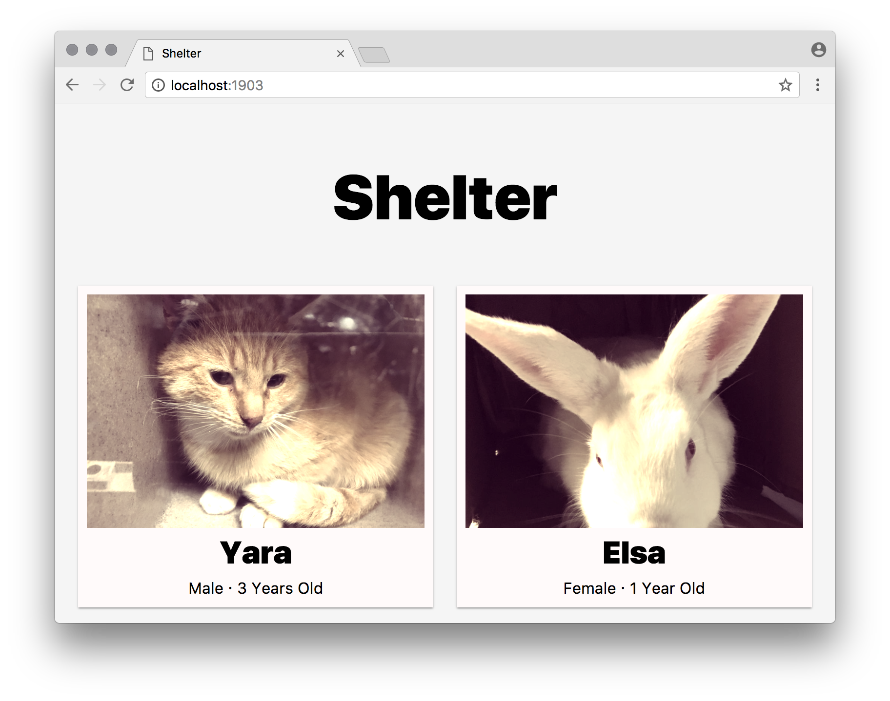

<!-- lint disable no-html -->

# Shelter

> A partially working Express server.
> Can you fix and finish it?




## Install

Fork this repository, `cd` into it, and:

```bash
npm install
npm run build # build and minify static files
npm start # runs server on `localhost:1902`
```

## Todo

There’s a lot of things left to do.
See the [assignment][] description for more info.

## Brief description of code

```txt
build.js - crawls new data (probably not needed)
db/data.json - raw data in json format
db/image/ - images for all animals
db/index.js - interface for accessing data
db/readme.md - docs for `db`
server/ - web server
server/helpers.js - utility functions used in the views to render animals
server/index.js - express server
src/index.css - unprocessed styles
src/index.js - unprocessed scripts
static/ - output of `src` after processing (these are sent to the browser)
view/detail.ejs - ejs template for one animal
view/list.ejs - ejs template for all animals
view/error.ejs - ejs template for errors
```

## Brief description of npm scripts

*   `npm start` — Start the server (on port 1902)
*   `npm test` — Tests the database
*   `npm run lint` — Check browser code and node code for problems
*   `npm run build` — Build browser code

## Data

Data is crawled (by `build.js`) from [nycacc][].
If you have the means to do so, you should consider becoming a foster parent,
volunteering at your local animal shelter, or donating!

## License

[MIT][] © [Titus Wormer][author]

[mit]: license

[author]: http://wooorm.com

[assignment]: https://github.com/cmda-be/course-17-18/blob/master/week-4.md#shelter

[nycacc]: http://nycacc.org
